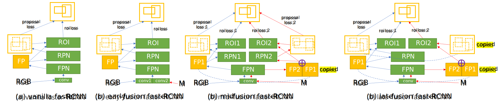

# Object Detection with Self-Supervised Scene Adaptation

This repository is the official implementation of paper

Zekun Zhang, Minh Hoai, *Object Detection with Self-Supervised Scene Adaptation*, CVPR 2023

[[PDF](media/zhang2023odsceneadaptive.pdf)] [[Poster](media/)] [[Video](media/)].

Scripts for downloading videos, extracted frames, annotations, and trained models are also provided. If you found our paper or dataset useful, please cite:
```bibtex
@inproceedings{zhang2023odsceneadaptive,
  title={Object Detection with Self-Supervised Scene Adaptation},
  author={Zekun Zhang and Minh Hoai},
  booktitle={IEEE Conference on Computer Vision and Pattern Recognition (CVPR)},
  year={2023}
}
```


<p align="center">Overview of proposed self-supervised scene adaptive object detection framework.</p>


<p align="center">Network architectures of proposed fusion faster-RCNN that takes object masks as additional input modality.</p>

[mosaic.webm](https://user-images.githubusercontent.com/10338705/223283108-66500928-fb67-4cd3-b777-c07b30e333c7.webm)

<p align="center">Some images from proposed <b>Scenes100</b> dataset with object bounding box annotations for evaluation.</p>

## 1. Environment Setup

Your system needs to have an NVIDIA GPU with at least 20GB VRAM to run the fusion model adaptation training with default settings. The GPU hardware and driver should support CUDA version 11.3 and later. This repository has been tested on Ubuntu 20.04 and 22.04. Older systems might not work. You system needs to have `curl` and `unzip` installed for the dataset downloading scripts to work. We recommend to start from a fresh Python environment and install the required packages to avoid incompatibility issues. For instance, you can create a new environment in Anaconda and switch to it:
```console
conda create -n scenes100
conda deactivate && conda activate scenes100
```

### Detectron2

Follow the instructions at [Detectron2 Installation](https://detectron2.readthedocs.io/en/latest/tutorials/install.html) to install detectron2 **v0.6**. Other versions will not work! During this process some other required packages such as `numpy`, `pytorch`, `torchvision`, `pillow`, `matplotlib`, `pycocotools`, and `tqdm` should also be installed as dependencies. Please verify that your detectron2 installation can work properly on your GPU before moving forward.

### Other Packages

Install the following packages using your preferred package manager.

`lmdb` is used to read the pre-extracted images. Follow the [official instructions](https://lmdb.readthedocs.io/en/release/).

`imageio` is used for reading and writing images. Follow the [official instructions](https://imageio.readthedocs.io/en/stable/).

`networkx` is used for the graph-based psuedo bounding boxes refinement. Follow the [official instructions](https://networkx.org/documentation/stable/install.html).

`imantics` is used for converting between polygons and pixel masks. Follow the instructions in the [official repository](https://github.com/jsbroks/imantics).

## 2. Download Scenes100 Dataset

Now please clone the repository and switch to the root directory:
```console
git clone git@github.com:cvlab-stonybrook/scenes100.git /your/path/scenes100
cd /your/path/scenes100
```
Each video in **Scenes100** has a unique 3-digits ID. In this repository wherever *ID* is used, it refers to this video ID unless specified otherwise. The 100 IDs are: `001 003 005 006 007 008 009 011 012 013 014 015 016 017 019 020 023 025 027 034 036 039 040 043 044 046 048 049 050 051 053 054 055 056 058 059 060 066 067 068 069 070 071 073 074 075 076 077 080 085 086 087 088 090 091 092 093 094 095 098 099 105 108 110 112 114 115 116 117 118 125 127 128 129 130 131 132 135 136 141 146 148 149 150 152 154 156 158 159 160 161 164 167 169 170 171 172 175 178 179`.

Please note the IDs are not consecutive. They should be treated as strings instead of integers. The whole downloaded and extracted dataset is about **2.2TB** in size. Make sure you have enough free space and good Internet connection. We suggest only to download the data for a few videos and test if everything else works. When using the following commands to download the dataset, please pay attention to the screen output, as certain operations can fail due to network issues. If the downloaded file for a certain ID is corrupted, please re-run the command to download it again.

First please download and extract the training data for video `001` and `003`:
```console
python datasets.py --opt download --target video --ids 001 003
python datasets.py --opt download --target image --ids 001 003
python datasets.py --opt extract  --target image --ids 001 003
```
You can replace `001 003` with `all` to download the whole dataset later. We use LMDB database to save the bundle of training images, but still extract the single images as individual JPEG files for training. You can write your own LMDB based dataloader for training. A minimum implementation is provided in [scenes100/training_frames.py](scenes100/training_frames.py) for your reference.

Then you can download and extract the files of manual annotated validation images, pseudo labels from detection and tracking, and background models:
```console
python datasets.py --opt download --target annotation
python datasets.py --opt extract  --target annotation
```
No video ID is specified because these commands always download the data for all the videos.

Lastly you can download and extract the source domain data, which is the MSCOCO-2017 dataset, and the base models trained on it:
```console
python datasets.py --opt download --target mscoco
python datasets.py --opt extract  --target mscoco
```
The images with target objects being inpainted are also downloaded. You can remove the ZIP files under `scenes100` and `mscoco` to save some space after extraction.

## 3. Run Experiments

### Adaptation Traininig

To run the adaptation training, use the script [train_adaptation.py](train_adaptation.py). Please check the arguments help information on how to use it. For instance, to train a vanilla faster-RCNN with R-101 backbone, with pseudo-labeling of R-101 and R-50 base models, run:
```console
python train_adaptation.py --id 001 --model r101-fpn-3x --ckpt mscoco/models/mscoco2017_remap_r101-fpn-3x.pth --anno_models r101-fpn-3x r50-fpn-3x --fusion vanilla --iters 4000 --eval_interval 501 --image_batch_size 4 --num_workers 4
```
To train a mid-fusion faster-RCNN with R-101 backbone, with pseudo-labeling of R-101 and R-50 base models, using location-aware mixup, run:
```console
python train_adaptation.py --id 001 --model r101-fpn-3x --ckpt mscoco/models/mscoco2017_remap_wdiff_midfusion_r101-fpn-3x.pth --anno_models r101-fpn-3x r50-fpn-3x --fusion midfusion --mixup 1 --iters 4000 --eval_interval 501 --image_batch_size 4 --num_workers 4
```
By default, the resulting checkpoints will be saved to the current directory.

### Evaluate Detection Performance

The average precision numbers computed during the training process is not accurate, for they do not involve the non-annotation masks. To get accurate AP numbers for adapted models, run:
```console
python evaluate_adaptation.py --opt single --id 001 --model r101-fpn-3x --ckpt adapt001_r101-fpn-3x_anno_train_001_refine_r101-fpn-3x_r50-fpn-3x.pth --fusion vanilla
python evaluate_adaptation.py --opt single --id 001 --model r101-fpn-3x --ckpt adapt001_r101-fpn-3x_anno_train_001_refine_r101-fpn-3x_r50-fpn-3x_midfusion_mixup.pth --fusion midfusion
```

### Compare with Base Models

To see how the adapted models perform compared to the base models, first evaluate the base model on all videos:
```console
python evaluate_adaptation.py --opt base --model r101-fpn-3x --ckpt mscoco/models/mscoco2017_remap_r101-fpn-3x.pth --base_result_json results_base_r101-fpn-3x.json
```
The results will be saved in files `results_base_r101-fpn-3x.json` and `results_base_r101-fpn-3x.pdf`. Then put the adapted model checkpoints in a separate directory. For instance, you can download our best adapted models by:
```console
mkdir -p trained_models/best_midfusion_mixup
curl --insecure https://vision.cs.stonybrook.edu/~zekun/scenes100/checkpoints/best_midfusion_mixup.zip --output trained_models/best_midfusion_mixup/best_midfusion_mixup.zip
unzip trained_models/best_midfusion_mixup/best_midfusion_mixup.zip -d trained_models/best_midfusion_mixup
```
We assume in the directory all the checkpoint files have the format of `adaptXXX*.pth`, where `XXX` is one of the video IDs. For each video ID there should only be 1 checkpoint presenting. To evaluate all the adapted models and compare with the already evaluated base model, run:
```console
python evaluate_adaptation.py --opt batch --model r101-fpn-3x --compare_ckpts_dir trained_models/best_midfusion_mixup --fusion midfusion --base_result_json results_base_r101-fpn-3x.json
```
Comparison results will be saved to the directory `trained_models/best_midfusion_mixup`. Due to variations of system and Python packages, the resulting AP gains can differ slightly from the numbers reported in the paper, but the difference should not be more than 0.05.

## 4. (Optional) Background Extraction

To generate dynamic background images by yourselves instead of using the provided ones, you need to have `opencv-python` installed to use its [image inpainting](https://docs.opencv.org/3.4/df/d3d/tutorial_py_inpainting.html) functions. Then run:
```console
mkdir background_001
python extract_background.py --id 001 --outputdir background_001
```
The inpainted dynamic background images will be saved to `background_001/inpaint` as JPEG files.

## 5. (Optional) Generate Pseudo Labels

Please follow these steps if you want to generate pseudo bounding boxes by yourselves instead of using the provided ones.

### PyTracking

Install PyTracking following the [official repository](https://github.com/visionml/pytracking). Please note that our code is tested with the commit `47d9c16`. Other version might cause issues. For our code to work, you only need to install `ninja-build`, `jpeg4py`, and `visdom` among the dependencies, and download the DiMP-50 model weights. [CUDA Toolkit](https://developer.nvidia.com/cuda-downloads) needs to be installed for PyTracking to compile the ROIPooling modules. The code has been tested with version `11.3`, but newer versions should all be compatible. You might need to refer to this [post](https://discuss.pytorch.org/t/question-about-thc-thc-h/147145) and replace `THCudaCheck` with `AT_CUDA_CHECK` in the ROIPooling code, if you encounter PyTorch C++ namespaces issues.

### Labeling

To run the pseudo labeling, use the script [pseudo_label.py](pseudo_label.py). Please check the arguments help information on how to use it. For instance, to detect the target objects in the training frames of video `003` using an R-101 base model, run:
```console
python pseudo_label.py --opt detect --id 003 --model r101-fpn-3x --ckpt mscoco/models/mscoco2017_remap_r101-fpn-3x.pth
```
The file containing the pseudo detection bounding boxes is saved to the current directory by default, as a GZIP file.

Then you can run the single object tracker using the detected pseudo bounding boxes as initializations:
```console
python pseudo_label.py --opt track --id 003 --detect_file 003_detect_r101-fpn-3x.json.gz --pytracking_dir /your/path/pytracking --cuda_dir /cuda/toolkit
```
The resulting GZIP file will also be saved to the current directory by default.
