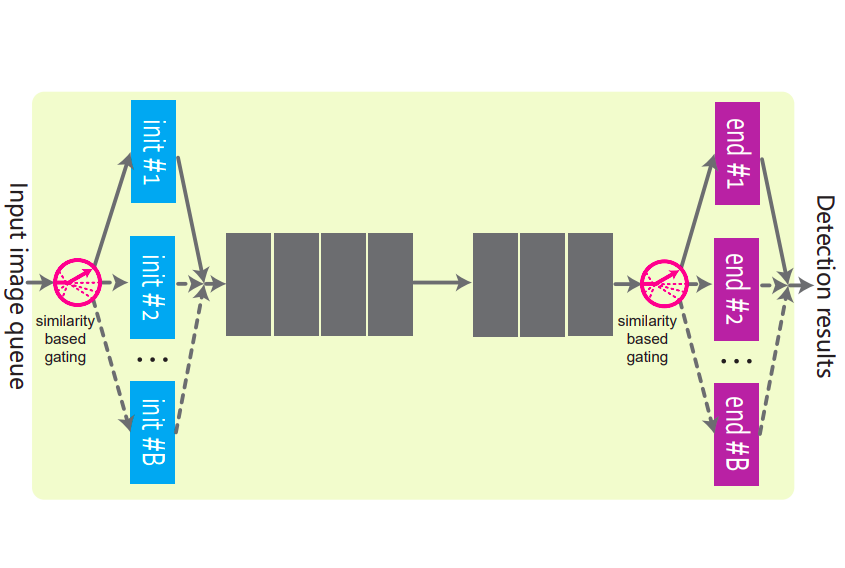
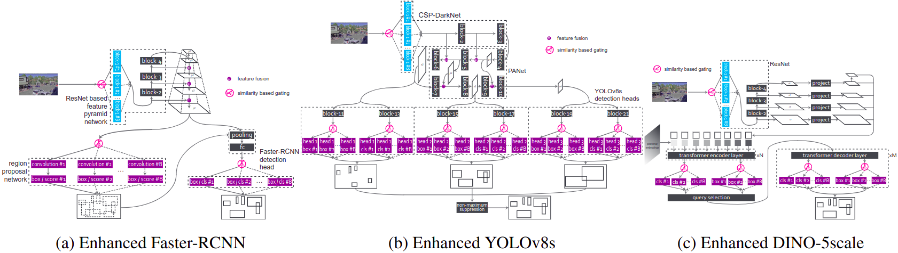

# Efficiency-Preserving Scene-Adaptive Object Detection

This repository is the official implementation of paper:

[Zekun Zhang](https://zvant.github.io/), [Vu Quang Truong](https://truong2710-cyber.github.io/), [Minh Hoai](https://www3.cs.stonybrook.edu/~minhhoai/), *Efficiency-Preserving Scene-Adaptive Object Detection*, BMVC 2024.

[[PDF](../media/efficienntSceneAdaptive-BMVC24.pdf)] [[Poster](../media/BMVC2024_poster.pdf)] [[Video Summary](../media/video_summary_moe.mp4)]

If you found our paper useful, please cite:

```bibtex
@inproceedings{m_Zhang-etal-BMVC24,  
  author = {Zekun Zhang and Vu Quang Truong and Minh Hoai},  
  title = {Efficiency-preserving Scene-adaptive Object Detection},  
  year = {2024},  
  booktitle = {Proceedings of British Machine Vision Conference},  
}
```


<p  align="center">Network architecture of the MoE-enhanced model.</p>



<p  align="center">Specific network architectures of MoE-enhanced Faster-RCNN, YOLOv8s and DINO-5scale.</p>

## 1. Preparation
See [README.md](../README.md) for the preparation of Scenes100, MSCOCO and the enviroment.

## 2. Run experiments
### Adaptation training
To run the adaptation training of the MoE models, please use the `train_b1.sh`, `train_b10.sh` and `train_b100.sh` in `script/ARCHITECTURE`. We provide the code for all three base architectures in the paper, which are Faster-RCNN, DINO-5scale and YOLOv8s. 

You can modify the arguments to perform 1-stage and 2-stage training. The file `create_mapper.sh` is used to generate the mapper from a model checkpoint, including random and $B$-Means gating. Please check the arguments help information on how to use them.

Specifically:

 - Modify `--ckpt` to choose the starting checkpoint of the model. If you use 1-stage training, make sure `--ckpt` is the base model. Otherwise, `--ckpt	` should be the warmed-up model.
 - Modify `--mapper` to choose the mapper for the model. You can leave it empty to use random gating or specify a `.pth` file for it for $B$-Means gating or any mapper you want. 

### Evaluate Detection Performance
Use the `eval_[ARCHITECTURE].py` file for evaluation. Please check the arguments help information on how to use it. You can use `--opt server` to get the AP score or `--opt tp` to measure throughput of the model. For example:
```console
# Measure throughput of DINO-5scale base model
python eval_dino.py --opt tp --ckpt ../../models/dino_5scale_remap_orig.pth --scale 1 --image_batch_size 4
# Get AP score of DINO-5scale base model
python eval_dino.py --opt server --ckpt ../../models/dino_5scale_remap_orig.pth --scale 1 --image_batch_size 4
```
 